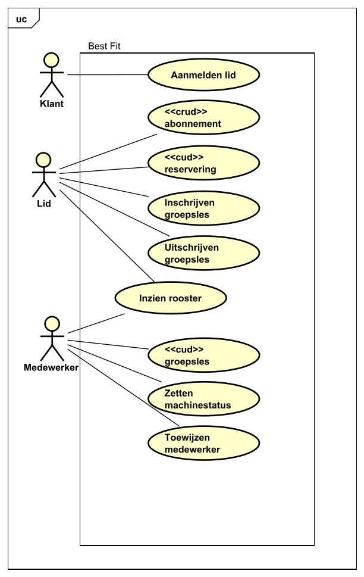
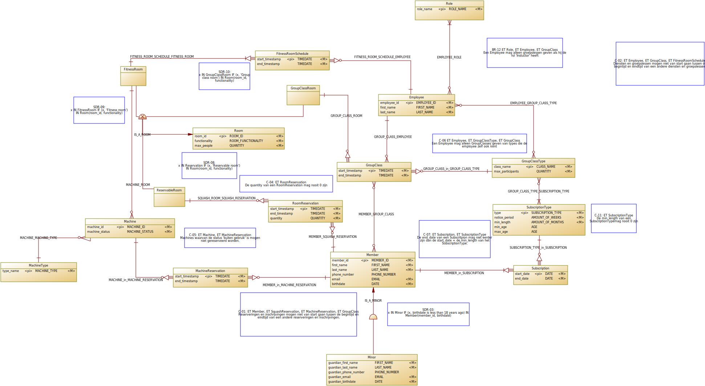

# Functioneel ontwerp

- [1 Inleiding](#1-inleiding)
- [2 User stories](#2-user-stories)
- [3 Eisen](#3-eisen)
  - [3.1 Functionele Eisen](#31-functionele-eisen)
    - [3.1.1 Abonnementen](#311-abonnementen)
    - [3.1.2 Groepslessen](#312-groepslessen)
    - [3.1.3 Medewerkers](#313-medewerkers)
    - [3.1.4 Ruimtes](#314-ruimtes)
    - [3.1.5 Reserveringen](#315-reserveringen)
    - [3.1.6 Overige functionele eisen](#316-overige-functionele-eisen)
  - [3.2 Verwoordingen](#32-verwoordingen)
- [4 Use cases](#4-use-cases)
  - [4.1 Use case diagram](#41-use-case-diagram)
  - [4.2 Brief Descriptions](#42-brief-descriptions)
  - [4.1 Fully dressed use cases](#43-fully-dressed-use-cases)
- [5 Conceptueel Datamodel](#5-conceptueel-datamodel)
- [5.1 Business Rules](#51-business-rules)
- [6 Interactie Model (CRUD-matrix)](#6-interactiemodel-crud-matrix)
- [7 Gebruikers](#7-gebruikers)
    
## 1. Inleiding

### 1.1 Doelstelling

Het doel van dit document is om een helder beeld te scheppen van het probleemdomein van Best Fit Gym. Dit is gedaan door 
middel van het opstellen van user stories, functionele eisen, use cases, een conceptueel datamodel met business rules, en 
een interactiemodel. Het conceptueel datamodel, dat op basis van verwoordingen gerealiseerd wordt, zorgt dat er een 
duidelijke structuur van de applicatie zichtbaar wordt. Ook wordt een interactiemodel opgesteld. Het doel van het interactiemodel 
is om te benoemen welke onderdelen van de applicatie met elkaar communiceren.

### 1.2 Nummeringen

In dit document is een aantal tabellen te vinden met user stories, eisen, use cases etc. Om de traceerbaarheid tussen alle
onderdelen te waarborgen zijn deze onderdelen individueel genummerd. Tussen de tabellen wordt onderling verwezen naar deze
nummeringen. Door middel van deze verwijzingen is elk onderdeel terug te traceren naar de user stories.

De nummering die aan elk onderdeel gegeven wordt is een unieke code. Deze code is opgesteld volgens het format *AB-00*. De letters
vormen een afkorting om aan te geven om welke categorie het gaat. Bij *User Story* is deze afkorting *US* en voor *Functional
Requirement* geldt de afkorting *FR*. Het getal in de code geeft aan om welk nummer binnen de categorie het onderdeel gaat.
Volgens deze nummering betekent *US-12* bijvoorbeeld *User Story 12* en is *FR-03* hetzelfde als *Functional Requirement 3*.

### 1.3 Leeswijzer

In dit document komen de volgende onderwerpen aan bod:

| **Hoofdstuk**             | **Beschrijving**                                                                                                                                                |
|---------------------------|-----------------------------------------------------------------------------------------------------------------------------------------------------------------|
| 2.  User stories          | Korte verhaaltjes vanuit het perspectief van de gebruikers met de wensen van het functioneren van het systeem.                                                  |
| 3.  Eisen                 | Eisen waar het systeem aan dient te voldoen. Deze eisen zijn afgeleid uit de user stories en zijn uitgewerkt in de vorm van functionele eisen en verwoordingen. |
| 3.1 Functionele eisen     | Functionele eisen die zijn afgeleid zijn uit de user stories. Deze eisen zijn ingedeeld op verschillende inhoudelijke categorieën.                              |
| 3.2 Verwoordingen         | Beschrijvingen in natuurlijke zinsopbouw die de gegevens weergeven die opgeslagen dienen te worden.                                                             |
| 4.  Use cases             | Scenario's waarin gebruikers het systeem zullen gebruiken. De use cases worden afgeleid uit de functionele eisen en zijn geschreven in fully-dressed format.    |
| 5.  Conceptueel datamodel | Model dat de verschillende gegevensstructuren weergeeft met hun onderlinge relaties.                                                                            |
| 5.1 Business rules        | Zakelijke beperkingen die in het systeem zijn opgelegd om functionaliteiten te ondersteunen.                                                                    |
| 6.  Interactiemodel       | Model dat de verschillende interacties tussen gebruiker en onderdelen van het systeem weergeeft. Dit is gedaan in de vorm van een CRUD-matrix.                  |

## 2. User stories

In dit hoofdstuk worden de user stories opgesteld die gebleken zijn uit gesprekken met de opdrachtgever. Deze user stories 
zijn zinnen in een verhalende vorm, die een wens van een gebruiker weergeven, waarin de gebruiker, wens en doelstelling beschreven 
worden. De user stories zijn genummerd volgens het format *US-00*. 

| **Code** | **User story**                                                                                                                                                                     |
|----------|------------------------------------------------------------------------------------------------------------------------------------------------------------------------------------|
| US-01    | Als lid wil ik mijn abonnement af kunnen sluiten, zodat ik gebruik kan maken van de faciliteiten van de Best Fit.                                                                  |
| US-02    | Als lid wil ik mijn abonnement op kunnen zeggen, zodat ik niet betaal voor een abonnement waar ik geen gebruik van ga maken.                                                       |
| US-03    | Als lid wil ik mijn abonnement kunnen verlengen, zodat ik toegang kan behouden tot de faciliteiten van de Best Fit.                                                                |
| US-04    | Als lid wil ik mijn abonnement in kunnen zien, zodat ik alle informatie over mijn abonnement kan zien.                                                                             |
| US-05    | Als lid wil ik machines kunnen reserveren, zodat ik garantie heb dat ik een machine om een bepaalde tijd kan gebruiken.                                                            |
| US-06    | Als lid wil ik squash ruimtes kunnen reserveren, zodat ik garantie heb dat ik om een bepaalde tijd de ruimte kan gebruiken.                                                        |
| US-07    | Als lid wil ik reserveringen voor machines kunnen annuleren, zodat ik geen onnodige reserveringen heb staan.                                                                       |
| US-08    | Als lid wil ik reserveringen voor squash ruimtes kunnen annuleren, zodat ik geen onnodige reserveringen heb staan.                                                                 |
| US-09    | Als lid wil ik een reservering voor een machine kunnen verplaatsen, zodat de reservering op de juiste tijd staat.                                                                  |
| US-10    | Als lid wil ik een reservering voor een squash ruimte kunnen verplaatsen, zodat de reservering op de juiste tijd staat.                                                            |
| US-11    | Als lid wil ik mijn reserveringen voor machines kunnen inzien, zodat ik na kan gaan om welke tijd mijn reserveringen staan.                                                        |
| US-12    | Als lid wil ik mijn reserveringen voor squash ruimtes kunnen inzien, zodat ik na kan gaan om welke tijd mijn reserveringen staan.                                                  |
| US-13    | Als lid wil ik me in kunnen schrijven voor een groepsles, zodat ik onder begeleiding van een instructeur geavanceerde sportactiviteiten kan uitvoeren.                             |
| US-14    | Als lid wil ik me uit kunnen schrijven voor een groepsles, zodat ik roosterconflicten kan voorkomen of niet hoef te sporten op een moment dat me niet uitkomt.                     |
| US-15    | Als lid wil ik mijn inschrijvingen in kunnen zien, zodat ik kan zien voor welke groepslessen ik ingeschreven sta.                                                                  |
| US-16    | Als medewerker wil ik de status van de machines kunnen aanpassen, zodat leden geen machines kunnen reserveren die buiten werking zijn.                                             |
| US-17    | Als medewerker wil ik een groepsles in kunnen plannen, zodat leden hier gebruik van kunnen maken door zich in te schrijven.                                                        |
| US-18    | Als medewerker wil ik een groepsles kunnen annuleren, zodat de leden die zich ingeschreven hebben voor de groepsles het te weten krijgen wanneer een groepsles niet door kan gaan. |
| US-19    | Als medewerker wil ik kunnen zien welke groepslessen ik moet geven zodat ik weet hoe laat ik op welke locatie aanwezig moet zijn om een groepsles te geven.                        |
| US-20    | Als medewerker wil ik groepslessen aan kunnen passen zodat ik de tijd van de groepsles kan verplaatsen of het onderwerp van de groepsles kan veranderen.                           |
| US-21    | Als medewerker wil ik mijzelf of een andere medewerker toe kunnen wijzen aan een fitnessruimte, zodat elke fitnessruimte in de sportschool bemand blijft.                          |
| US-22    | Als medewerker wil ik kunnen zien wanneer ik toegewezen ben aan een fitnessruimte, zodat ik weet wanneer ik in deze ruimte aanwezig moet zijn.                                     |
| US-23    | Als lid wil ik dat er in elke ruimte een medewerker aanwezig is zodat ik niet sport zonder begeleiding                                                                             |
| US-24    | Als klant wil ik lid kunnen worden van Best Fit, zodat ik een abonnement kan afsluiten en gebruik kan maken van de faciliteiten van Best Fit.                                      |

## 3. Eisen
In dit hoofdstuk worden de eisen beschreven die betrekking hebben tot de functionaliteit van het informatiesysteem. Dit 
hoofdstuk is opgedeeld in twee onderdelen, namelijk de functionele eisen en de verwoordingen van feiten binnen het 
informatiesysteem. Uit de functionele eisen zullen use cases volgen. Over deze use cases zal meer te lezen zijn in 
hoofdstuk 3. Uit de verwoordingen volgt het conceptueel datamodel. Dit model is te zien in hoofdstuk 4.

Dit hoofdstuk beschrijft niet alle eisen die aan de applicatie verbonden zijn. Zoals eerder vermeld worden namelijk alleen 
de eisen benoemd die betrekking hebben tot de functionaliteit van het informatiesysteem. Hiernaast zijn ook niet-
functionele eisen gebonden aan het systeem. Deze niet-functionele eisen zijn te vinden in het Technisch Ontwerp.

### 3.1 Functionele Eisen
Het informatiesysteem moet voldoen aan een verzameling functionele eisen. Deze eisen zijn opgesteld vanuit gesprekken met 
de opdrachtgever en de casusbeschrijving. Om een overzicht te bewaren over de toepassingen van de functionele eisen zijn deze eisen opgedeeld in categorieën. Deze 
categorieën zijn abonnementen, groepslessen, medewerkers, ruimtes, machines en reserveringen. 

#### 3.1.1 Abonnementen

| **Code** | **Beschrijving**                                                                                             | **Gerelateerde user story** |
|----------|--------------------------------------------------------------------------------------------------------------|-----------------------------|
| FR-01    | Het moet mogelijk zijn om meerdere verschillende abonnementen tegelijk te hebben.                            | US-01                       |
| FR-02    | Als minderjarige heb je een volwassene nodig om een abonnement af te sluiten.                                | US-01                       |
| FR-03    | Als volwassene abonnee wordt je naam, email, telefoonnummer en geboortedatum opgeslagen.                     | US-01                       |
| FR-04    | Als minderjarige abonnee wordt de naam, email, telefoonnummer, geboortedatum van jou en je voogd opgeslagen. | US-01, US-04                |
| FR-05    | Bij een abonnee wordt opgeslagen of het abonnement actief is.                                                | US-01, US-02, US-03         |
| FR-06    | Abonnementen hebben een minimale lengte waarin ze actief moeten zijn.                                        | US-02                       |
| FR-07    | Abonnementen hebben een opzegtermijn.                                                                        | US-02                       |
| FR-08    | Abonnementen kunnen leeftijdsgrenzen hebben (Senioren abonnement, Junioren abonnement).                      | US-01, US-02                |
| FR-09    | Per type abonnement verschilt het welke activiteiten je binnen de sportschool kan doen.                      | US-01                       |
| FR-10    | Elk lid heeft minstens 1 abonnement (actief of inactief).                                                    | US-24                       |

#### 3.1.2 Groepslessen
| **Code** | **Beschrijving**                                                                                              | **Gerelateerde user story** |
|----------|---------------------------------------------------------------------------------------------------------------|-----------------------------|
| FR-11    | Je kan je alleen inschrijven voor een groepsles als je een abonnement hebt dat gekoppeld is aan de groepsles. | US-01, US-13                |
| FR-12    | Groepslessen hebben een maximaal aantal deelnemers.                                                           | US-17                       |

#### 3.1.3 Medewerkers
| **Code** | **Beschrijving**                                                                       | **Gerelateerde user story** |
|----------|----------------------------------------------------------------------------------------|-----------------------------|
| FR-13    | Per begeleider moet vastgelegd worden welke lessen hij of zij mag geven.               | US-17                       |
| FR-14    | Medewerkers mogen alleen groepslessen geven in onderwerpen waar ze les in mogen geven. | US-17                       |
| FR-15    | Medewerkers kunnen niet meerdere groepslessen en/of toewijzingen tegelijk hebben.      | US-17, US-21                |

#### 3.1.4 Ruimtes
| **Code** | **Beschrijving**                                                                   | **Gerelateerde user story** |
|----------|------------------------------------------------------------------------------------|-----------------------------|
| FR-16    | Alle ruimtes hebben een maximaal aantal deelnemers.                                | US-05, US-06, US-17         |
| FR-17    | Elke ruimte is óf squashruimte, óf een fitnessruimte, óf een groepslesruimte.      |                             |

#### 3.1.5 Reserveringen
| **Code** | **Beschrijving**                                                                | **Gerelateerde user story**              |
|----------|---------------------------------------------------------------------------------|------------------------------------------|
| FR-18    | Een reservering staat op 1 naam.                                                | US-07, US-08, US-09, US-10, US-11, US-12 |
| FR-19    | Voor een squash ruimte reservering kan je opgeven met hoeveel mensen je bent.   | US-06, US-08, US-10, US-12               |
| FR-20    | Een abonnee kan niet meerdere groepslessen en/of reserveringen tegelijk hebben. | US-05, US-06, US-13                      |

### 3.1.6 Overige functionele eisen
| **Code** | **Beschrijving**                                                                     |
|----------|--------------------------------------------------------------------------------------|
| FR-21    | Er moet een geschiedenistabel bijgehouden worden voor iedere tabel in de database.   |
| FR-22    | De geschiedenis-tabellen moeten automatisch geüpdate worden.                         |

### 3.2 Verwoordingen
#### 1 Voornaam van lid
Het lid met lidnummer <u>123</u> heeft als voornaam <u>Tom</u>.

| <u>456</u>        | <u>Anna</u>     |
|-------------------|-----------------|
| ET: Member        | Att: first_name |
| ID: att member_id |                 |

Lid met lidnummer < member_id > heeft als voornaam < first_name >.

---------------------------------------------------------------------
#### 2 Achternaam van lid
Het lid met lidnummer <u>123</u> heeft als achternaam <u>Blauw</u>.

| <u>456</u> | <u>Smit</u>    |
|------------|----------------|
| ET: Member | Att: last_name |
| MATCH      |                |

Lid met lidnummer < member_id > heeft als achternaam < last_name >.

--------------------------------------------------------------------------
#### 3 Email van lid
Het lid met lidnummer <u>123</u> heeft als email <u>TomBlauw@gmail.com</u>.

| <u>456</u> | <u>AJ.Smit@icloud.com</u> |
|------------|---------------------------|
| ET: Member | Att: email                |
| MATCH      |                           |

Lid met lidnummer < member_id > heeft als email < email >.

------------------------------------------------------------------------
#### 4 Telefoonnummer van lid
Lid met lidnummer <u>123</u> heeft het telefoonnummer <u>0612767683</u>.

| <u>456</u> | <u>0682937456</u> |
|------------|-------------------|
| ET: Member | Att: phone_number |
| MATCH      |                   |

Lid met lidnummer < member_id > heeft het telefoonnummer < phone_number >.

-------------------------------------------------------------------------
#### 5 Geboortedatum van lid
Lid met lidnummer <u>123</u> is geboren op <u>20/08/1993</u>.

| <u>456</u> | <u>01/04/2006</u> |
|------------|-------------------|
| ET: Member | Att: birthdate    |
| MATCH      |                   |

Lid met lidnummer < member_id > is geboren op < birthdate >.

--------------------------------------------------------------------------
#### 6 Voornaam van voogd van lid
Lid met lidnummer <u>465</u> heeft de voogd met de voornaam <u>Daan</u>.

| <u>789</u> | <u>Harry</u>            |
|------------|-------------------------|
| ET: Member | Att guardian_first_name |
| MATCH      |                         |

Lid met lidnummer < member_id > heeft de voogd met de voornaam < guardian_first_name >.

--------------------------------------------------------------------------
#### 7 Achternaam van voogd van lid
Lid met lidnummer <u>123</u> heeft de voogd met de achternaam <u>Smit</u>.

| <u>839</u> | <u>Burgt</u>           |
|------------|------------------------|
| ET: Member | Att guardian_last_name |
| MATCH      |                        |

Lid met lidnummer < member_id > heeft de voogd met de achternaam < guardian_last_name >.

--------------------------------------------------------------------------
#### 8 Email van voogd van lid

Lid met lidnummer <u>456</u> heeft de voogd met de email <u>D.Smit@gmail.com</u>.

| <u>789</u> | <u>ReneeBurgt@gmail.nl</u> |
|------------|----------------------------|
| ET: Member | Att guardian_email         |
| MATCH      |                            |

Lid met lidnummer < member_id > heeft de voogd met de email < guardian_email >.

--------------------------------------------------------------------------
#### 9 Telefoonnummer van voogd van lid

Lid met lidnummer <u>456</u> heeft de voogd met het telefoonnummer <u>0633204836</u>.

| <u>789</u> | <u>0623894567</u>         |
|------------|---------------------------|
| ET: Member | Att guardian_phone_number |
| MATCH      |                           |

Lid met lidnummer < member_id > heeft de voogd met het telefoonnummer < guardian_phone_number >.

----------------------------------------------------------------------------
#### 10 Geboortedatum van voogd van lid
Lid met lidnummer <u>456</u> heeft de voogd met de geboortedatum <u>20/02/1982</u>.

| <u>789</u> | <u>30/03/1973</u>     |
|------------|-----------------------|
| ET: Member | Att guardian_birthday |
| MATCH      |                       |

Lid met lidnummer < member_id > heeft de voogd met de geboortedatum < guardian_birthday >.

--------------------------------------------------------------------------
#### 11 Opzegtermijn van abonnement
Abonnementen van het type <u>ALLES</u> hebben een opzegtermijn van <u>4</u> weken.

| <u>SQUASH</u>        | <u>2</u>           |
|----------------------|--------------------|
| ET: SubscriptionType | Att: notice_period |
| ID: att type         |                    |

Abonnementen van het type < type > hebben een opzegtermijn van < notice_period > weken.

------------------------------------------------------------------------------------
#### 12 Minimumlengte van abonnement
Abonnementen van het type <u>ALLES</u> hebben een minimumlengte van <u>3</u> maanden.

| <u>SQUASH</u>        | <u>12</u>       |
|----------------------|-----------------|
| ET: SubscriptionType | Att: min_length |
| MATCH                |                 |

Abonnementen van het type < type > hebben een opzegtermijn van < min_length > maanden.

------------------------------------------------------------------------------------
#### 13 Minimumleeftijd van abonnement
Abonnementen van het type <u>ALLES</u> hebben een minimumleeftijd van <u>18</u> jaar.

| <u>SQUASH</u>        | <u>21</u>    |
|----------------------|--------------|
| ET: SubscriptionType | Att: min_age |
| MATCH                |              |

Abonnementen van het type < type > hebben een minimumleeftijd van < min_age > jaar.

------------------------------------------------------------------------------------
#### 14 Maximumleeftijd van abonnement
Abonnementen van het type <u>ALLES</u> hebben een maximumleeftijd van <u>18</u> jaar.

| <u>SQUASH</u>        | <u>21</u>    |
|----------------------|--------------|
| ET: SubscriptionType | Att: max_age |
| MATCH                |              |

Abonnementen van het type < type > hebben een maximumleeftijd van < max_age > jaar.

------------------------------------------------------------------------------------
#### 15 Type van machine
De machine met het id <u>18</u> heeft het type <u>leg press</u>.

| <u>23</u>           | <u>lat pull down</u> |
|---------------------|----------------------|
| ET: Machine         | ET MachineType       |
| ID: att machine_id  | ID: att type_name    |

De machine met het id < machine_id > heeft het type < type_name >.
RT MACHINE_MACHINE_TYPE tussen MACHINE en MACHINE_TYPE.

----------------------------------------------------------------------------------------------
#### 16 Status van machine
De machine met het id <u>18</u> heeft als status <u>werkend</u>.

| <u>23</u>   |  <u>buiten gebruik</u> |
|-------------|------------------------|
| ET: Machine | Att machine_status     |
| MATCH       |                        |

De machine met het id < machine_id > heeft als status < status >.

-----------------------------------------------------------------------------

#### 17 Ruimte van machine
De machine met het id <u>18</u> staat in ruimte <u>XYZ</u>.

| <u>23</u>   | <u>ABC</u>      |
|-------------|-----------------|
| ET: Machine | ET Room         |
| MATCH       | ID: att room_id |

De machine met het id < machine_id > staat in ruimte < room_id >.
RT MACHINE_in_ROOM tussen MACHINE en ROOM.

---------------------------------------------------------------------------

#### 18 Maximaal aantal mensen in ruimte
In ruimte <u>XYZ</u> mogen maximaal <u>4</u> mensen zijn.

| <u>ABC</u> | <u>30</u>      |
|------------|----------------|
| ET Room    | att max_people |
| MATCH      |                |

In ruimte < room_id > mogen maximaal < max_people > mensen zijn.

---------------------------------------------------------------------------
#### 19 Functionaliteit van ruimte
Ruimte <u>EFG</u> is geschikt voor <u>groepslessen</u>.

| <u>ABC</u> | <u>fitness</u>    |
|------------|-------------------|
| ET: Room   | att functionality |
| MATCH      |                   |

Ruimte < room_id > is geschikt voor < functionality >.

----------------------------------------------------------------------------
#### 20 Abonnementen van groepsles
De groepsles <u>DansA</u> is mogelijk voor leden met het abonnement <u>DANS</u>.

| <u>YogaB</u>       | <u>ALLES</u>         |
|--------------------|----------------------|
| ET: GroupClassType | ET: SubscriptionType |
| ID: att class_name | MATCH                |

De groepsles < class_name > is mogelijk voor leden met het abonnement < type >.
RT GROUP_CLASS_TYPE_SUBSCRIPTION_TYPE tussen GROUP_CLASS_TYPE en SUBSCRIPTION_TYPE.

---------------------------------------------------------------------------
#### 21 Maximaal aantal deelnemers van groepsles
De groepsles <u>DansA</u> kan een maximaal aantal van <u>10</u> deelnemers hebben.

| <u>YogaB</u>       |  <u>15</u>            |
|--------------------|-----------------------|
| ET: GroupClassType | Att: max_participants |
| MATCH              |                       |

De groepsles < class_name > kan een maximaal aantal van < max_participants > deelnemers hebben.

-----------------------------------------------------------------------------
#### 22 Voornaam van medewerker
De medewerker <u>876</u> heeft de voornaam <u>Julia</u>.

| <u>902</u>          | <u>Juliët</u>   |
|---------------------|-----------------|
| ET: Employee        | Att: first_name |
| ID: att employee_id |                 |

De medewerker < employee_id > heeft de voornaam < first_name >.

-----------------------------------------------------------------------------
#### 23 Achternaam van medewerker
De medewerker <u>876</u> heeft de achternaam <u>de Bos</u>.

| <u>902</u>   | <u>van Huizen</u> |
|--------------|-------------------|
| ET: Employee | Att: last_name    |
| MATCH        |                   |

De medewerker < employee_id > heeft de voornaam < last_name >.

-----------------------------------------------------------------------

#### 24 Rol van medewerker
De medewerker <u>876</u> is een <u>Manager</u>.

| <u>902</u>   | <u>Instructeur</u> |
|--------------|--------------------|
| ET: Employee | ET: Role           |
| MATCH        | ID: att role_name  |

De medewerker < employee_id > is een < role_name >
RT EMPLOYEE_ROLE tussen EMPLOYEE en ROLE.

-----------------------------------------------------------------------------------
#### 25 Groepsles type van medewerker
De medewerker <u>876</u> is in staat om groepsles <u>DansA</u> te geven.

| <u>902</u>   | <u>YogaB</u>       |
|--------------|--------------------|
| ET: Employee | ET: GroupClassType |
| MATCH        | Match              |

De medewerker < employee_id > is in staat om groepsles < class_name > te geven.
RT EMPLOYEE_GROUP_CLASS_TYPE tussen EMPLOYEE en GROUP_CLASS_TYPE.

-----------------------------------------------------------------------------------
#### 26 Medewerker van groepsles
De groepsles van het type <u>DansA</u> om <u>9:00 17/05/2023</u> in ruimte <u>EFG</u> wordt gegeven door de medewerker <u>876</u>.

| <u>YogaB</u> - <u>14:00 19/05/2023</u> - <u>EFG</u>   | <u>902</u>   |
|-------------------------------------------------------|--------------|
| ET: GroupClass                                        | ET: Employee |
| ID: ET GroupClassType + att class_timestamp + ET Room | MATCH        |
| MATCH MATCH                                           |              |

De groepsles van het type < class_name > om < start_timestamp > in ruimte < room_id > wordt gegeven door de medewerker < employee_id >.
RT GROUP_CLASS_EMPLOYEE tussen GROUP_CLASS en EMPLOYEE.

-----------------------------------------------------------------------------------------
#### 27 Eindtijd van groepsles
De groepsles van het type <u>DansA</u> om <u>9:00 17/05/2023</u> in ruimte <u>EFG</u> is afgelopen om <u>11:00 17/05/2023</u>.

| <u>YogaB</u> - <u>14:00 19/05/2023</u> - <u>EFG</u> | <u>15:30 19/05/2023</u> |
|-----------------------------------------------------|-------------------------|
| ET: GroupClass                                      | att class_duration      |
| MATCH                                               |                         |

De groepsles van het type < type > om < start_timestamp > in ruimte < room_id > is afgelopen om < end_timestamp >.

----------------------------------------------------------------------------------------
#### 28 Groepsles van lid
Voor lid <u>123</u> is er een inschrijving voor groepsles <u>DansA</u> op <u>17-04-2023 8:30:52</u> in ruimte <u>EFG</u>.

| <u>456</u> | <u>YogaB</u> - <u>10-06-2023 8:30:52</u> - <u>EFG</u> |
|------------|-------------------------------------------------------|
| ET: Member | ET GroupClass                                         |
| MATCH      | MATCH                                                 |

Voor lid < member_id > is er een inschrijving voor groepsles < class_name > op < start_timestamp > in ruimte < room_id >.
RT MEMBER_in_GROUP_CLASS tussen MEMBER en GROUP_CLASS.

------------------------------------------------------------------------------------
#### 29 Einddatum van abonnement
Het abonnement voor lid <u>123</u> van het type <u>ALLES</u> vanaf <u>03/02/2023</u> eindigt op <u>03/02/2024</u>.

| <u>456</u> - <u>SQUASH</u> - <u>12/12/2022</u>        |  <u>12/6/2023</u> |
|-------------------------------------------------------|-------------------|
| ET: Subscription                                      | Att end_date      |
| ID: ET Member + ET SubscriptionType + att start_date  |                   |
| MATCH           MATCH                                 |                   |

Het abonnement voor lid < member_id > van het type < type > vanaf < start_date > eindigt op < end_date >.
RT MEMBER_of_SUBSCRIPTION tussen SUBSCRIPTION(dependent) en MEMBER.
RT SUBSCRIPTION_TYPE_of_SUBSCRIPTION tussen SUBSCRIPTION(dependent) en SUBSCRIPTION_TYPE.

---------------------------------------------------------------------------
#### 30 Status van abonnement
Het abonnement voor lid <u>123</u> van het type <u>ALLES</u> vanaf <u>03/02/2023</u> heeft als status <u>actief</u>.

| <u>456</u> - <u>SQUASH</u> - <u>12/12/2022</u> |  <u>inactief</u>        |
|------------------------------------------------|-------------------------|
| ET: Subscription                               | Att subscription_status |
| MATCH                                          |                         |

Het abonnement voor lid < member_id > van het type < type > vanaf < start_date > heeft als status < status >.

----------------------------------------------------------------------------
#### 31 Betaald tot van abonnement
Het abonnement voor lid <u>123</u> van het type <u>ALLES</u> vanaf <u>03/02/2023</u> heeft betaald tot <u>20-08-2023</u>.

| <u>456</u> - <u>SQUASH</u> - <u>12/12/2022</u> |  <u>10-12-2023</u> |
|------------------------------------------------|--------------------|
| ET: Subscription                               | Att paid_until     |
| MATCH                                          |                    |

Het abonnement voor lid < member_id > van het type < type > vanaf < start_date > heeft betaald tot < paid_until >.

----------------------------------------------------------------------------------------
#### 32 Aantal mensen van squashreservering
De squash reservering van lid <u>123</u> voor ruimte <u>XYZ</u> om <u>14:00 25/04/2023</u> is een reservering voor <u>4</u> mensen.

| <u>456</u> - <u>ABC</u> - <u>11:00 04/05/2023</u> | <u>1</u>      |
|---------------------------------------------------|---------------|
| ET: RoomReservation                               | att quantity  |
| ID: ET Member + ET Room + Att start_timestamp     |               |
| MATCH           MATCH                             |               |
|                                                   |               |

De reservering van lid < member_id > voor ruimte < room_id > om < start_timestamp > is een reservering voor < quantity > mensen.
RT MEMBER_in_RESERVATION tussen ROOM_RESERVATION(dependent) en MEMBER.
RT ROOM_ROOM_RESERVATION tussen ROOM_RESERVATION(dependent) en ROOM.

----------------------------------------------------
#### 33 eindtijd van squashreservering
De squash reservering van lid <u>123</u> voor ruimte <u>HIJ</u> om <u>14:00 25/04/2023</u> is afgelopen om <u>15:00 25/04/2023</u>.

| <u>456</u> - <u>HIJ</u> - <u>11:00 04/05/2023</u> | <u>11:30 04/05/2023</u> |
|---------------------------------------------------|-------------------------|
| ET: RoomReservation                               | att end_timestamp       |
| MATCH                                             |                         |

De reservering van lid < member_id > voor ruimte < room_id > om < start_timestamp > is afgelopen om < end_timestamp >.

------------------------------------------------------------------------
#### 34 Einddatum van machine reservatie
De reservering van lid 123 voor de machine 18 vanaf 10:00 18/04/2023 eindigt op <u>10:15 18/04/2023</u>.

| <u>456</u> - <u>23</u> - <u>9:00 17/04/2023</u>    | <u>9:20 17/04/2023</u>    |
|----------------------------------------------------|---------------------------|
| ET: MachineReservation                             | Att end_timestamp         |
| ID: ET Member + ET Machine + att start_timestamp   |                           |
| MATCH        MATCH                                 |                           |

De reservering van lid < member_id > voor de machine < machine_id > vanaf < start_timestamp > eindigt op < end_timestamp >.
RT MEMBER_of_MACHINE_RESERVATION tussen MACHINE_RESERVATION(dependent) en MEMBER.
RT MACHINE_of_MACHINE_RESERVATION tussen MACHINE_RESERVATION(dependent) en MACHINE.

-----------------------------------------------------------------------------------
#### 35 Eindtijd van begeleiding
De begeleider <u>876</u> overziet de ruimte <u>XYZ</u> vanaf <u>8:30 17/04/2023</u> tot <u>12:30 17/04/2023</u>.

| <u>902</u> - <u>ABC</u> - <u>15:00 23/05/2023</u> | <u>20:00 23/05/2023</u> |
|---------------------------------------------------|-------------------------|
| ET: FitnessRoomSchedule                           | Att: end_timestamp      |
| ID: ET Employee + ET Room + att start_timestamp   |                         |
| MATCH MATCH                                       |                         |
 
De begeleider < employee_id > overziet de ruimte < room_id > vanaf < start_timestamp > tot < end_timestamp >.
RT EMPLOYEE_FITNESS_ROOM_SCHEDULE tussen FITNESS_ROOM_SCHEDULE(dependent) en EMPLOYEE.
RT ROOM_FITNESS_ROOM_SCHEDULE tussen FITNESS_ROOM_SCHEDULE(dependent) en ROOM.

## 4. Use cases

### 4.1 Use case diagram

### 4.2 Brief Descriptions
| Use case | Actor           | Naam                     | Brief Description                                                                                                                            |
|----------|-----------------|--------------------------|----------------------------------------------------------------------------------------------------------------------------------------------|
| UC-01    | Lid             | Afsluiten abonnement     | Een lid sluit een abonnement af van variërende duur.                                                                                         |
| UC-02    | Lid             | Verlengen abonnement     | Een lid verlengt een aflopend abonnement.                                                                                                    |
| UC-03    | Lid             | Opzeggen abonnement      | Een lid kan een afgesloten abonnement opzeggen.                                                                                              |
| UC-04    | Lid             | Inzien abonnement        | Een lid ziet zijn / haar huidige actieve abonnement(en) in.                                                                                  |
| UC-05    | Lid             | Inschrijven groepsles    | Het lid schrijft zich onder een bepaalde naam in voor een groepsles. Hierbij kan het lid aangeven voor hoe veel mensen deze inschrijving is. |
| UC-06    | Lid             | Uitschrijven groepsles   | Het lid kan zich uitschrijven voor een groepsles waar hij of zij zich voor heeft ingeschreven.                                               |
| UC-07    | Lid             | Plaatsen reservering     | Het lid plaatst een reservering voor een machine of squashruimte.                                                                            |
| UC-08    | Lid             | Uitschrijven reservering | Het lid schrijft zich uit voor een reservering.                                                                                              |
| UC-09    | Lid             | Aanpassen reservering    | Het lid verplaatst een reservering voor een specifieke machine.                                                                              |
| UC-10    | Lid, Medewerker | Inzien rooster           | Het lid of de medewerker geeft aan zijn rooster te willen bekijken en krijgt alle informatie over rooster te zien.                           |
| UC-11    | Medewerker      | Zetten machinestatus     | Een medewerker past de status van een machine aan omdat deze bijvoorbeeld kapot is of weer gerepareerd is.                                   |
| UC-12    | Medewerker      | Inplannen groepsles      | Een medewerker plant een groepsles in binnen een bepaalde ruimte om een bepaalde tijd.                                                       |
| UC-13    | Medewerker      | Verplaatsen groepsles    | Een medewerker verplaatst een bepaalde groepsles naar een bepaalde tijd.                                                                     |
| UC-14    | Medewerker      | Afzeggen groepsles       | Een medewerker zegt een groepsles af.                                                                                                        |    
| UC-15    | Medewerker      | Toewijzen medewerker     | Leden kunnen een abonnement afsluiten van variërende duur.                                                                                   |
| UC-16    | Klant           | Aanmelden Lid            | Een klant wordt lid van Best Fit door een abonnement af te sluiten en persoonlijke informatie op te slaan.                                   |

### 4.3 Fully Dressed use cases
#### UC-01
| Afsluiten abonnement                                           |                                                                                               |
|----------------------------------------------------------------|-----------------------------------------------------------------------------------------------|
| **Primaire actor(en):**                                        | Lid.                                                                                          |
| **Stakeholders:**                                              | Bestuur Best Fit. Aandeelhouders Best Fit.                                                    |
| **Brief description:**                                         | Een lid sluit een abonnement af van variërende duur.                                          |
| **Precondities:**                                              |                                                                                               |
| **Postcondities:**                                             | Er staat een abonnement actief op naam van het lid                                            |
| **Hoofd successcenario:**                                      |                                                                                               |
| **Actor Actie**                                                | **Systeemverantwoordelijkheid**                                                               |
| 1. Een lid geeft aan een abonnement af te willen sluiten.      |                                                                                               |
|                                                                | 5. Het systeem vraagt het lid om een abonnement te selecteren.                                |
| 6. Het lid kiest een abonnement en bevestigt deze.             |                                                                                               |
|                                                                | 7. Het systeem slaat het abonnement op onder naam van het betreffende lid.                    |
| **Alternatieve Stroom:**                                       |                                                                                               |

#### UC-02
| Verlengen abonnement                                                  |                                                                                                               |
|-----------------------------------------------------------------------|---------------------------------------------------------------------------------------------------------------|
| **Primaire actor(en):**                                               | Lid.                                                                                                          |
| **Stakeholders:**                                                     | Bestuur Best Fit. Aandeelhouders Best Fit.                                                                    |
| **Brief description:**                                                | Een lid verlengt een aflopend abonnement.                                                                     |
| **Precondities:**                                                     | Een lid heeft UC-01 met succes afgerond. Het abonnement dat is afgesloten in UC-01 is actief.             |
| **Postcondities:**                                                    | De verloopdatum van het abonnement van het lid is verschoven met de gekozen duur.                             |
| **Hoofd successcenario:**                                             |                                                                                                               |
| **Actor Actie**                                                       | **Systeemverantwoordelijkheid**                                                                               |
| 1. Het lid geeft aan zijn abonnement te willen verlengen.             |                                                                                                               |
|                                                                       | 2. Het systeem toont een scherm waar het abonnement verlengd kan worden.                                      |
| 3. Het lid vult de gegevens voor het verlengen van een abonnement in. |                                                                                                               |
| 4. Het lid bevestigt zijn keuze.                                      |                                                                                                               |
|                                                                       | 5. Het systeem stelt de einddatum van het abonnement in op de oorspronkelijke einddatum plus de gekozen duur. |
| **Alternatieve Stroom:**                                              |                                                                                                               |
|                                                                       | 5a. Het systeem toont een foutmelding omdat de ingevulde gegevens niet kloppen.                               |

#### UC-03
| Opzeggen abonnement                                        |                                                                                                                       |
|------------------------------------------------------------|-----------------------------------------------------------------------------------------------------------------------|
| **Primaire actor(en):**                                    | Lid.                                                                                                                  |
| **Stakeholders:**                                          |                                                                                                                       |
| **Brief description:**                                     | Een lid kan een afgesloten abonnement opzeggen.                                                                       |
| **Precondities:**                                          | Een lid heeft UC-01 met succes afgerond. Het abonnement dat is afgesloten in UC-01 is actief.                     |
| **Postcondities:**                                         | Het abonnement is vanaf het volgende betalingsmoment inactief en er wordt geen geld meer afgeschreven van het lid.    |
| **Hoofd successcenario:**                                  |                                                                                                                       |
| **Actor Actie**                                            | **Systeemverantwoordelijkheid**                                                                                       |
| 1. Het lid geeft aan het abonnement stop te willen zetten. |                                                                                                                       | 
|                                                            | 2. Het systeem stelt een controlevraag ter bevestiging.                                                               | 
| 3. Het lid bevestigt de opzegging van het abonnement.      |                                                                                                                       |  
|                                                            | 4. Het systeem verplaatst de einddatum van het abonnement naar de huidige datum + de opzegtermijn van het abonnement. | 
| **Alternatieve Stroom:**                                   |                                                                                                                       |

#### UC-04
| Inzien abonnement                                               |                                                                  |
|-----------------------------------------------------------------|------------------------------------------------------------------|
| **Primaire actor(en):**                                         | Lid.                                                             |
| **Stakeholders:**                                               | Bestuur Best Fit. Aandeelhouders Best Fit.                       |
| **Brief description:**                                          | Een lid ziet zijn / haar huidige actieve abonnement(en) in.      |
| **Precondities:**                                               |                                                                  |
| **Postcondities:**                                              | Er staat een abonnement actief op naam van het lid.              |
| **Hoofd successcenario:**                                       |                                                                  |
| **Actor Actie**                                                 | **Systeemverantwoordelijkheid**                                  |
| 1. Een lid geeft aan zijn of haar abonnement in te willen zien. |                                                                  |
|                                                                 | 2. Het systeem laat de data van het betreffende abonnement zien. |
| 3. Het lid krijgt de data van zijn of haar abonnement te zien.  |                                                                  |
| **Alternatieve Stroom:**                                        |                                                                  |

#### UC-05
| Inschrijven groepsles                                                                       |                                                                                                                                                                                                                                         |
|---------------------------------------------------------------------------------------------|-----------------------------------------------------------------------------------------------------------------------------------------------------------------------------------------------------------------------------------------|
| **Primaire actor(en):**                                                                     | Lid.                                                                                                                                                                                                                                    |
| **Stakeholders:**                                                                           | Medewerkers Best Fit.                                                                                                                                                                                                                   |
| **Brief description:**                                                                      | Het lid schrijft zich onder een bepaalde naam in voor een groepsles. Hierbij kan het lid aangeven voor hoe veel mensen deze inschrijving is.                                                                                            |
| **Precondities:**                                                                           | Er staat een abonnement waarmee groepslessen gevolgd kunnen worden actief op naam van het lid.                                                                                                                                          |
| **Postcondities:**                                                                          | Er is een inschrijving opgeslagen in het systeem met de naam en het aantal mensen voor wie de inschrijving geldt.                                                                                                                       |
| **Hoofd successcenario:**                                                                   |                                                                                                                                                                                                                                         |
| **Actor Actie**                                                                             | **Systeemverantwoordelijkheid**                                                                                                                                                                                                         |
| 1. Het lid geeft aan zich in te willen schrijven voor een groepsles.                        |                                                                                                                                                                                                                                         |
|                                                                                             | 2. Het systeem toont een overzicht van alle groepslessen met de tijdstippen waarop deze plaatsvinden.                                                                                                                                   |
| 3. Het lid geeft aan voor welke groepsles hij zich wil inschrijven en bevestigt zijn keuze. |                                                                                                                                                                                                                                         |
|                                                                                             | 4. Het systeem geeft informatie over deze specifieke groepsles weer.                                                                                                                                                                    |
| 5. Het lid vult zijn gegevens in en bevestigt zijn inschrijving.                            |                                                                                                                                                                                                                                         |
|                                                                                             | 6. De inschrijving wordt opgeslagen in het systeem.                                                                                                                                                                                     |
| **Alternatieve Stroom:**                                                                    |                                                                                                                                                                                                                                         |
|                                                                                             | 6a. *De groepsles zit vol of de reservering overlapt met andere reserveringen van het lid* Het systeem geeft aan dat de groepsles al vol zit of dat het lid al reserveringen in zijn rooster heeft die overlappen met de groepsles. |

#### UC-06
| Uitschrijven groepsles                                                                                   |                                                                                                |
|----------------------------------------------------------------------------------------------------------|------------------------------------------------------------------------------------------------|
| **Primaire actor(en):**                                                                                  | Lid.                                                                                           |
| **Stakeholders:**                                                                                        |                                                                                                |
| **Brief description:**                                                                                   | Het lid kan zich uitschrijven voor een groepsles waar hij of zij zich voor heeft ingeschreven. |
| **Precondities:**                                                                                        | Het lid heeft UC-04 met succes afgerond.                                                       |
| **Postcondities:**                                                                                       | Het lid is uitgeschreven voor de groepsles waar hij of zij voor ingeschreven stond.            |
| **Hoofd successcenario:**                                                                                |                                                                                                |
| **Actor Actie**                                                                                          | **Systeemverantwoordelijkheid**                                                                |
| 1. Het lid geeft aan zich uit te willen schrijven voor een groepsles.                                    |                                                                                                |
|                                                                                                          | 2. Het systeem toont een overzicht met alle groepslessen waar het lid voor ingeschreven staat. |
| 3. Het lid geeft aan voor welke groepsles hij / zij zich wil uitschrijven en bevestigt zijn keuze.       |                                                                                                |
|                                                                                                          | 4. Het systeem verwijderd de inschrijving van het lid.                                         |
| **Alternatieve Stroom:**                                                                                 | **Systeemverantwoordelijkheid**                                                                |
| 3a. Het lid probeert zich uit te schrijven voor een groepsles waar hij of zij niet voor ingeschreven is. |                                                                                                |
|                                                                                                          | 4a. Het systeem geeft een passende foutmelding.                                                |

#### UC-07
| Plaatsen reservering                                                                 |                                                                                                   |
|--------------------------------------------------------------------------------------|---------------------------------------------------------------------------------------------------|
| **Primaire actor(en):**                                                              | Lid                                                                                               |
| **Stakeholders:**                                                                    |                                                                                                   |
| **Brief description:**                                                               | Het lid plaatst een reservering voor een machine of squashruimte.                                 |
| **Precondities:**                                                                    | Het lid heeft een abonnement waarmee hij machines en/of squashruimtes mag reserveren.             |
| **Postcondities:**                                                                   | Het lid heeft een reservering gemaakt.                                                            |
| **Hoofd successcenario:**                                                            |                                                                                                   |
| **Actor Actie**                                                                      | **Systeemverantwoordelijkheid**                                                                   |
| 1. Het lid geeft aan een reservering te willen plaatsen.                             |                                                                                                   |
|                                                                                      | 2. Het systeem weergeeft een scherm met machines en squashruimtes die gereserveerd kunnen worden. |
| 3. Het lid kiest een faciliteit die hij / zij wil reserveren.                        |                                                                                                   |
|                                                                                      | 4. Het systeem weergeeft een agenda met de beschikbare tijden voor de gekozen faciliteit.         |
| 5. Het lid vult de informatie voor de reservering in.                                |                                                                                                   |
|                                                                                      | 6. Het systeem vraagt om bevestiging.                                                             |
| 7. Het lid bevestigt de reservering.                                                 |                                                                                                   |
|                                                                                      | 8. Het systeem slaat de reservering op.                                                           |
| **Alternatieve Stroom:**                                                             |                                                                                                   |
|                                                                                      | 8a. Het systeem geeft een passende foutmelding omdat de faciliteit niet gereserveerd kan worden.  |

#### UC-08
| Uitschrijven reservering                                                                   |                                                                                                                                                   |
|--------------------------------------------------------------------------------------------|---------------------------------------------------------------------------------------------------------------------------------------------------|
| **Primaire actor(en):**                                                                    | Lid                                                                                                                                               |
| **Stakeholders:**                                                                          |                                                                                                                                                   |
| **Brief description:**                                                                     | Het lid schrijft zich uit voor een reservering.                                                                                                   |
| **Precondities:**                                                                          | Het lid heeft UC-06 met success afgerond.                                                                                                         |
| **Postcondities:**                                                                         | De reservering van het lid is verwijderd uit het systeem.                                                                                         |
| **Hoofd successcenario:**                                                                  |                                                                                                                                                   |
| **Actor Actie**                                                                            | **Systeemverantwoordelijkheid**                                                                                                                   |
| 1. Het lid geeft aan zich uit te willen schrijven voor een reservering.                    |                                                                                                                                                   |
|                                                                                            | 2. Het systeem toont een overzicht met alle reserveringen van het lid zodat het lid kan kiezen voor welke reservering hij zich uit wil schrijven. |
| 2. Het lid kiest welke reservering hij zich voor wil uitschrijven en bevestigt zijn keuze. |                                                                                                                                                   |
|                                                                                            | 4. Het systeem verwijderd de reservering van het lid.                                                                                             |
| **Alternatieve Stroom:**                                                                   |                                                                                                                                                   |

#### UC-09
| Aanpassen reservering                                       |                                                                                                                                     |
|-------------------------------------------------------------|-------------------------------------------------------------------------------------------------------------------------------------|
| **Primaire actor(en):**                                     | Lid                                                                                                                                 |
| **Stakeholders:**                                           |                                                                                                                                     |
| **Brief description:**                                      | Het lid verplaatst een reservering voor een specifieke machine.                                                                     |
| **Precondities:**                                           | Het lid heeft UC-06 met success afgerond.                                                                                           |
| **Postcondities:**                                          | De datum en tijd van de reservering zijn aangepast in het systeem.                                                                  |
| **Hoofd successcenario:**                                   |                                                                                                                                     |
| **Actor Actie**                                             | **Systeemverantwoordelijkheid**                                                                                                     |
| 1. Het lid geeft aan zijn reservering aan te willen passen. |                                                                                                                                     |
|                                                             | 2. Het systeem weergeeft een overzicht met de huidige toestand van de reservering en de tijden waarop de faciliteit beschikbaar is. |
| 3. Het lid vult de nieuwe gegevens voor de reservering in.  |                                                                                                                                     |
|                                                             | 4. Het systeem past de bestaande reservering aan.                                                                                   |
| **Alternatieve Stroom:**                                    |                                                                                                                                     |
|                                                             | 4a. Het systeem weergeeft een foutmelding aangezien het lid of de faciliteit niet beschikbaar is op de gekozen tijd.                |

#### UC-10
| Inzien rooster                                                         |                                                                                                                    |
|------------------------------------------------------------------------|--------------------------------------------------------------------------------------------------------------------|
| **Primaire actor(en):**                                                | Lid, Medewerker                                                                                                    |
| **Stakeholders:**                                                      |                                                                                                                    |
| **Brief description:**                                                 | Het lid of de medewerker geeft aan zijn rooster te willen bekijken en krijgt alle informatie over rooster te zien. |
| **Precondities:**                                                      | In het geval dat een lid zijn rooster wil bekijken heeft het lid heeft UC-06 met success afgerond.                 |
| **Postcondities:**                                                     |                                                                                                                    |
| **Hoofd successcenario:**                                              |                                                                                                                    |
| **Actor Actie**                                                        | **Systeemverantwoordelijkheid**                                                                                    |
| 1. Het lid of de medewerker geeft aan zijn rooster te willen bekijken. |                                                                                                                    |
|                                                                        | 2. Het systeem haalt alle informatie over het rooster van het lid of de medewerker op en retourneert dit.          |
| **Alternatieve Stroom:**                                               |                                                                                                                    |

#### UC-11
| Zetten machinestatus                                                                                                                          |                                                                                                                               |
|-----------------------------------------------------------------------------------------------------------------------------------------------|-------------------------------------------------------------------------------------------------------------------------------|
| **Primaire actor(en):**                                                                                                                       | Medewerker                                                                                                                    |
| **Stakeholders:**                                                                                                                             | Lid                                                                                                                           |
| **Brief description:**                                                                                                                        | Een medewerker past de status van een machine aan omdat deze bijvoorbeeld kapot is of weer gerepareerd is.                    |
| **Precondities:**                                                                                                                             |                                                                                                                               |
| **Postcondities:**                                                                                                                            | De status van de machine is veranderd.                                                                                        |
| **Hoofd successcenario:**                                                                                                                     |                                                                                                                               |
| **Actor Actie**                                                                                                                               | **Systeemverantwoordelijkheid**                                                                                               |
| 1. De medewerker geeft aan de status van een machine aan te willen passen.                                                                    |                                                                                                                               |
|                                                                                                                                               | 2. Het systeem weergeeft een overzicht van alle machines                                                                      |
| 3. De medewerker selecteert een machine waar hij / zij de status van wil aanpassen.                                                           |                                                                                                                               |
|                                                                                                                                               | 4. Het systeem toont de huidige status van de machine en vraagt de gebruiker wat de nieuwe status van de machine moet worden. |
| 5. De medewerker vult in wat de nieuwe status van de machine moet worden.                                                                     |                                                                                                                               |
|                                                                                                                                               | 6. Het systeem past de status van de machine aan.                                                                             |                                                                                                            |
| **Alternatieve Stroom:**                                                                                                                      |                                                                                                                               |

#### UC-12
| Inplannen groepsles                                                                                                                                     |                                                                                                                                                     |
|---------------------------------------------------------------------------------------------------------------------------------------------------------|-----------------------------------------------------------------------------------------------------------------------------------------------------|
| **Primaire actor(en):**                                                                                                                                 | Medewerker                                                                                                                                          |
| **Stakeholders:**                                                                                                                                       | Lid                                                                                                                                                 |
| **Brief description:**                                                                                                                                  |                                                                                                                                                     |
| **Precondities:**                                                                                                                                       |                                                                                                                                                     |
| **Postcondities:**                                                                                                                                      | De groepsles staat opgeslagen in het systeem.                                                                                                       |
| **Hoofd successcenario:**                                                                                                                               |                                                                                                                                                     |
| **Actor Actie**                                                                                                                                         | **Systeemverantwoordelijkheid**                                                                                                                     |
| 1. Een medewerker geeft aan een groepsles in te willen plannen.                                                                                         |                                                                                                                                                     |
|                                                                                                                                                         | 2. Het systeem weergeeft een overzicht met alle beschikbare ruimtes en tijden.                                                                      |
| 3. De medewerker vult in om wat voor een groepsles het gaat, in welke ruimte hij gegeven moet worden, hoe laat de groepsles is en wie de begeleider is. |                                                                                                                                                     |
|                                                                                                                                                         | 4. Het systeem slaat de groepsles op.                                                                                                               |
| **Alternatieve Stroom:**                                                                                                                                |                                                                                                                                                     |
|                                                                                                                                                         | 4a. Het systeem weergeeft een foutmelding omdat de begeleider bijvoorbeeld om het gekozen tijdstip geen tijd heeft of omdat de ruimte niet vrij is. |

#### UC-13
| Verplaatsen groepsles                                                             |                                                                                                                                                     |
|-----------------------------------------------------------------------------------|-----------------------------------------------------------------------------------------------------------------------------------------------------|
| **Primaire actor(en):**                                                           | Medewerker                                                                                                                                          |
| **Stakeholders:**                                                                 | Lid                                                                                                                                                 |
| **Brief description:**                                                            | Een medewerker verplaatst een bepaalde groepsles naar een bepaalde tijd.                                                                            |
| **Precondities:**                                                                 |                                                                                                                                                     |
| **Postcondities:**                                                                | De groepsles staat opgeslagen in het systeem en de tijd van de groepsles is aangepast.                                                              |
| **Hoofd successcenario:**                                                         |                                                                                                                                                     |
| **Actor Actie**                                                                   | **Systeemverantwoordelijkheid**                                                                                                                     |
| 1. Een medewerker geeft aan een groepsles te willen verplaatsen.                  |                                                                                                                                                     |
|                                                                                   | 2. Het systeem weergeeft een overzicht van alle groepslessen.                                                                                       |
| 3. De medewerker selecteert een specifieke groepsles om te verplaatsen            |                                                                                                                                                     |
|                                                                                   | 4. Het systeem weergeeft een overzicht met alle beschikbare ruimtes en tijden.                                                                      |
| 5. De medewerker kiest een nieuwe tijd voor de groepsles en bevestigt zijn keuze. |                                                                                                                                                     |
|                                                                                   | 6. Het systeem verplaatst de groepsles naar de nieuwe gekozen tijd.                                                                                 |
| **Alternatieve Stroom:**                                                          |                                                                                                                                                     |
|                                                                                   | 6a. Het systeem weergeeft een foutmelding omdat de begeleider bijvoorbeeld om het gekozen tijdstip geen tijd heeft of omdat de ruimte niet vrij is. |

#### UC-14
| Afzeggen groepsles                                             |                                                               |
|----------------------------------------------------------------|---------------------------------------------------------------|
| **Primaire actor(en):**                                        | Medewerker                                                    |
| **Stakeholders:**                                              | Lid                                                           |
| **Brief description:**                                         | Een medewerker zegt een groepsles af.                         |
| **Precondities:**                                              |                                                               |
| **Postcondities:**                                             | De gekozen groepsles is verwijderd uit het systeem.           |
| **Hoofd successcenario:**                                      |                                                               |
| **Actor Actie**                                                | **Systeemverantwoordelijkheid**                               |
| 1. Een medewerker geeft aan een groepsles af te willen zeggen. |                                                               |
|                                                                | 2. Het systeem weergeeft een overzicht met alle groepslessen. |
| 3. Selecteert de groepsles die hij / zij af wil zeggen.        |                                                               |
|                                                                | 4. Het systeem vraagt om bevestiging.                         |
| 5. De medewerker bevestigd zijn / haar keuze.                  |                                                               |
|                                                                | 6. Het systeem verwijderd de groepsles.                       |
| **Alternatieve Stroom:**                                       |                                                               |

#### UC-15
| Toewijzen medewerker                                                                    |                                                                                                                                                                                 |
|-----------------------------------------------------------------------------------------|---------------------------------------------------------------------------------------------------------------------------------------------------------------------------------|
| **Primaire actor(en):**                                                                 | Medewerker                                                                                                                                                                      |
| **Stakeholders:**                                                                       |                                                                                                                                                                                 |
| **Brief description:**                                                                  | Een medewerker kan zichzelf of een collega toewijzen aan een ruimte voor een bepaalde tijd aangezien de Best Fit wil dat er op ieder moment een medewerker is in iedere ruimte. |
| **Precondities:**                                                                       | Er is een fitness ruimte.                                                                                                                                                       |
| **Postcondities:**                                                                      | Het systeem heeft de toegewezen dienst opgeslagen en de gekozen medewerker kan dit in zijn rooster zien.                                                                        |
| **Hoofd successcenario:**                                                               |                                                                                                                                                                                 |
| **Actor Actie**                                                                         | **Systeemverantwoordelijkheid**                                                                                                                                                 |
| 1. De medewerker geeft aan iemand te willen toewijzen aan een fitness ruimte.           |                                                                                                                                                                                 |
|                                                                                         | 2. Het systeem weergeeft een overzicht van de fitness ruimtes en wanneer er al medewerkers ingepland zijn en wanneer niet.                                                      |
| 3. De medewerker kiest een ruimte en tijd waarop hij iemand wil toewijzen.              |                                                                                                                                                                                 |
|                                                                                         | 4. Het systeem weergeeft een lijst met medewerkers die daar naar toegewezen kunnen worden.                                                                                      |
| 5. De medewerker wijst de ruimte en tijd toe aan een medewerker (of mogelijk zichzelf). |                                                                                                                                                                                 |
|                                                                                         | 6. Het systeem weergeeft de toewijzing en vraagt om bevestiging.                                                                                                                |
| 7. De medewerker bevestigt de toewijzing.                                               |                                                                                                                                                                                 |
|                                                                                         | 8. Het systeem slaat de toewijzing op.                                                                                                                                          |
| **Alternatieve Stroom  :**                                                              |                                                                                                                                                                                 |

#### UC-16
| Aanmelden lid                                                                          |                                                                                                           |
|----------------------------------------------------------------------------------------|-----------------------------------------------------------------------------------------------------------|
| **Primaire actor(en):**                                                                | Klant                                                                                                     |
| **Stakeholders:**                                                                      |                                                                                                           |
| **Brief description:**                                                                 | Een klant wordt lid van Best Fit door een abonnement af te sluiten en persoonlijke informatie op te slaan |
| **Precondities:**                                                                      | -                                                                                                         |
| **Postcondities:**                                                                     | Het systeem heeft de informatie en een abonnement van het nieuwe lid opgeslagen.                          |
| **Hoofd successcenario:**                                                              |                                                                                                           |
| **Actor Actie**                                                                        | **Systeemverantwoordelijkheid**                                                                           |
| 1. De klant geeft aan een abonnement af te willen sluiten en dat ze nog geen lid zijn. |                                                                                                           |
|                                                                                        | 2. Het systeem weergeeft een scherm waar de klant zijn informatie kan invullen.                           |
| 3. De klant vult zijn informatie in.                                                   |                                                                                                           |
| 4. De klant bevestigd klaar te zijn.                                                   |                                                                                                           |
|                                                                                        | 5. Het systeem slaat de informatie op zodat de klant nu een lid is.                                       |
| 6. [ Het nieuwe lid voert UC-01 Afsluiten abonnement uit ]                             |                                                                                                           |
| **Alternatieve Stroom  :**                                                             |                                                                                                           |

## 5. Conceptueel Datamodel

### 5.1 Business Rules

| **Code** | **Business Rule**                                                                         | **Gerelateerde user story**                     |
|----------|-------------------------------------------------------------------------------------------|-------------------------------------------------|
| BR-01    | Een lid mag in zijn rooster geen overlappende inschrijvingen of reserveringen hebben.     | US-05 t/m US-15 exclusief (US-07, US-08, US-14) |
| BR-02    | Een medewerker mag in zijn rooster geen overlappende diensten en groepslessen hebben.     | US-17 t/m US-22 exclusief (US-18)               |
| BR-03    | Voor leden onder de 18 moeten de gegevens van een voogd opgeslagen worden.                | US-01, US-03                                    |
| BR-04    | Een reservering van een squashruimte mag nooit een reservering voor 0 personen zijn.      | US-06, US-10                                    |
| BR-05    | Een machine die buiten gebruik is mag niet gereserveerd worden.                           | US-05, US-09, US-16                             |
| BR-06    | Een medewerker mag alleen groepslessen geven van types waar hij les in mag geven.         | US-17, US-20                                    |
| BR-07    | Een abonnement mag niet inactief worden voordat de minimumlengte verlopen is.             | US-02                                           |
| BR-08    | Alleen squashruimtes mogen gereserveerd worden.                                           | US-06                                           |
| BR-09    | Alleen fitnessruimtes hebben machines.                                                    | US-22                                           |
| BR-10    | Alleen in groepslesruimtes mogen groepslessen gegeven worden.                             | US-17, US-20                                    |
| BR-11    | De minimumlengte van een abonnement mag niet 0 zijn.                                      | US-01, US-03                                    |
| BR-12    | Alleen medewerkers die ook een instructeur zijn mogen groepslessen geven.                 | US-17, US-20                                    |
| BR-13    | Een lid mag alleen reserveringen aanmaken die voor de einddatum van zijn abonnement zijn. | US-05, US-06, US-09, US-10, US-13               |

### 5.2 Constraints
Bij het vertalen van business rules naar constraints hebben we dezelfde nummering aangehouden. Constraint C-01 is dus ontstaan uit BR-01, constraint SDR-03 is ontstaan uit BR-03 etc.

| **Code** | **Gerelateerde entiteiten**                                                          | **Constraint / SDR**                                                                                                                                            |
|----------|--------------------------------------------------------------------------------------|-----------------------------------------------------------------------------------------------------------------------------------------------------------------|
| C-01     | ET Member, ET RoomReservation, ET MachineReservation, ET GroupClass                  | Reserveringen en inschrijvingen mogen niet van start gaan tussen de begintijd en eindtijd van een andere reserveringen en inschrijvingen.                       |
| C-02     | ET Employee, ET GroupClass, ET FitnessRoomSchedule                                   | Diensten en groepslessen mogen niet van start gaan tussen de begintijd en eindtijd van een andere diensten en groepslessen.                                     |
| SDR-03   | ET Member                                                                            | x IN Minor IF (x, birthdate is less than 18 years ago)  IN Member(member_id, birthdate).                                                                        |
| C-04     | ET RoomReservation                                                                   | De quantity van een RoomReservation mag nooit 0 zijn.                                                                                                           |
| C-05     | ET Machine, ET MachineReservation                                                    | Machines waarvan de status 'buiten gebruik' is mogen niet gereserveerd worden.                                                                                  |
| C-06     | ET Employee, ET GroupClassType, ET GroupClass                                        | Een Employee mag alleen GroupClasses geven van types die de employee zelf ook kent.                                                                             |
| C-07     | ET Subscription, ET SubscriptionType                                                 | De status van een subscription mag niet naar 'inactief' gezet mogen worden voordat minimaal de minimum_length van het SubscriptionType is verlopen.             |
| SDR-08   | ET Room                                                                              | x IN RoomReservation IF (x, 'Reservable room') IN Room(room_id, functionality).                                                                                 |
| SDR-09   | ET Room                                                                              | x IN FitnessRoom IF (x, 'Fitness room') IN Room(room_id, functionality).                                                                                        |
| SDR-10   | ET Room                                                                              | x IN GroupClassRoom IF (x, 'Group class room') IN Room(room_id, functionality).                                                                                 |
| C-11     | ET SubscriptionType                                                                  | De min_length van een SubscriptionType mag nooit 0 zijn.                                                                                                        |
| C-12     | ET Role, ET Employee, ET GroupClass                                                  | Een Employee mag alleen groepslessen geven als hij de rol 'Instuctor' heeft.                                                                                    |
| C-13     | ET Subscription, ET Member, ET RoomReservation, ET MachineReservation, ET GroupClass | Een RoomReservation, MachineReservation of inschrijving voor een GroupClass mag niet bestaan voor een datum na de einddatum van de Subscription van een Member. |

## 6. Interactiemodel (CRUD-matrix)
| Code  | Use case                 |  Member | Guardian | Subscription | SubscriptionType | GroupClassType | Employee | GroupClass | RoomReservation | MachineReservation | Machine | MachineType | Room | FitnessRoomSchedule |
|-------|--------------------------|---------|----------|--------------|------------------|----------------|----------|------------|-----------------|--------------------|---------|-------------|------|---------------------|
| UC-01 | Afsluiten abonnement     | R       | R        | C            | R                |                |          |            |                 |                    |         |             |      |                     |
| UC-02 | Verlengen abonnement     | R       | R        | U            | R                |                |          |            |                 |                    |         |             |      |                     |
| UC-03 | Opzeggen abonnement      | R       | R        | D            | R                |                |          |            |                 |                    |         |             |      |                     |
| UC-04 | Inzien abonnement        |         | R        | R            | R                |                |          |            |                 |                    |         |             |      |                     |
| UC-05 | Inschrijven groepsles    | R       |          | R            | R                |                |          | R          |                 |                    |         |             |      |                     |
| UC-06 | Uitschrijven groepsles   | R       |          |              |                  |                |          | R          |                 |                    |         |             |      |                     |
| UC-07 | Plaatsen reserveringen   | R       |          |              |                  |                |          | R          | C               | C                  | R       | R           | R    |                     |
| UC-08 | Uitschrijven reservering | R       |          |              |                  |                |          |            | D               | D                  | R       |             |      |                     |
| UC-09 | Aanpassen reservering    | R       |          |              |                  |                |          |            | U               | U                  | R       |             |      |                     |
| UC-10 | Bekijken rooster         | R       |          |              |                  |                | R        | R          | R               | R                  | R       |             |      | R                   |
| UC-11 | Zetten machinestatus     |         |          |              |                  |                | R        |            |                 |                    | U       |             |      |                     |
| UC-12 | Inplannen groepsles      |         |          |              |                  | R              | R        | C          |                 |                    |         |             | R    |                     |
| UC-13 | Verplaatsen groepsles    |         |          |              |                  | R              | R        | U          |                 |                    |         |             |      |                     |
| UC-14 | Afzeggen groepsles       |         |          |              |                  |                |          | D          |                 |                    |         |             |      |                     |
| UC-15 | Medewerker toewijzen     |         |          |              |                  |                | R        |            |                 |                    |         |             | U    | C                   |

## 7. Gebruikers

De applicatie die gerealiseerd gaat worden heeft verschillende soorten gebruikers,
in dit hoofdstuk worden al soorten gebruikers kort benoemd en wat hen rechten binnen het systeem bevatten.

### 7.1 Member

Het systeem kent onder andere de gebruiker genaamd 'member' en dit is een lid van Best Fit, members hebben rechten om reserveringen te maken voor squashruimtes, 
reserveringen te maken voor machines en zich in te schrijven voor groepslessen. Alle members met reserveringen of inschrijvingen 
hebben ook de rechten om zijn of haar reservering of inschrijving te annuleren of te verplaatsen/veranderen als een andere datum beter uitkomt of als de 
member besluit liever een andere groepsles te volgen. Als een member zijn of haar abonnement wil verlengen kan hij of zij dat
zelf, ook kan de member een abonnement afsluiten en opzeggen mits de minimale lengte van het abonnement voorbij is.

### 7.2 Employee

Binnen het systeem is er ook een gebruiker genaamd 'employee', dit is een medewerker van Best Fit.
De employee heeft rechten om groepslessen in te plannen en zijn of haar rooster in te zien wanneer er lessen gegeven moeten worden.
Ook kunnen employees een machine status aanpassen, bijvoorbeeld als deze buiten gebruik is door onderhoud.

### 7.3 Manager

De gebruiker 'manager' is een medewerker van Best Fit die een leidinggevende rol heeft, 
deze medewerker heeft dan ook meer rechten in het systeem dan gewone medewerkers. De manager heeft alle rechten die employees ook hebben
plus de rechten om een groepsles af te zeggen of te verplaatsen. Ook kunnen managers medewerkers toewijzen aan een ruimte 
en kunnen ze het lesrooster inzien van andere employees.

### 7.4 Admin

De admin gebruiker heeft alle rechten in het hele systeem. Dit is van belang, omdat 
mocht er een fout gemaakt worden bij het ingeven van gegevens o.i.d., dan kan de admin dit aanpassen.
**Deze rol moet nog besproken worden**