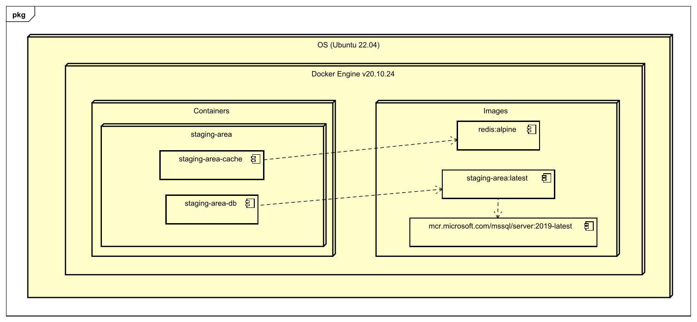
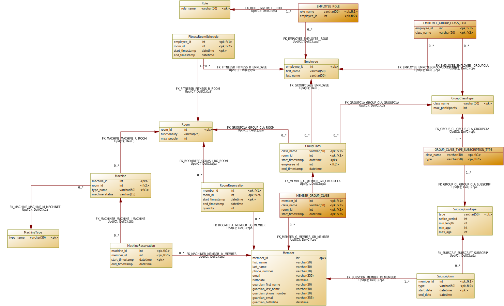

# Technisch ontwerp

- [1 Inleiding](#1-inleiding)
- [2 Niet functionele eisen](#2-niet-functionele-eisen)
- [3 Systeemarchitectuur](#3-systeemarchitectuur)
- [4 Technische gegevensstructuur](#4-technische-gegevensstructuur)
  - [4.1 Fysiek datamodel](#41-fysiek-datamodel)
  - [4.2 Integrity rules](#42-integrity-rules)
- [5 Technische realisatie](#5-technische-realisatie)

## 1. Inleiding

Het doel van het technisch ontwerp is om vast te leggen hoe de technische gegevensstructuur er uit gaat zien. Het moet
mogelijk zijn om hier in terug te vinden welke functionele requirements hebben geleid tot welke ontwerpkeuzes. Door in eerste
instantie de functionele eisen te nummeren is het makkelijker om te refereren naar specifieke eisen en kunnen er
bijvoorbeeld business rules opgeschreven worden met het nummer van de originele eis waar deze uit ontstaan zijn. Verder komen
er in dit document een systeemarchitectuur, dit is het conceptueel model dat de structuur, het gedrag en verschillende weergaven van een systeem definieert. 
een PDM met de bijhorende integrity rules en een technische realisatie interface.

## 2. Niet functionele eisen

| **Code** | **Beschrijving** |
|----------|------------------|
|          |                  |

In dit hoofdstuk worden de niet-functionele eisen genoteerd, niet-functionele eisen zijn
aanvullende eisen die gesteld worden aan het systeem, maar niet direct bijdragen aan het te behalen functionele doel.

## 3. Systeemarchitectuur

[//]: # (TODO: Versienummers bij images)
[//]: # (TODO: Uitleggen waarom deze versienummers [docker engine en ubuntu] gekozen zijn)

## 4. Technische gegevensstructuur

### 4.1 Fysiek datamodel

### 4.2 Integrity rules

| **Code** | **Integrity rule** |
|----------|--------------------|
| IR-01    |                    |
| IR-02    |                    |
| IR-03    |                    |
| IR-04    |                    |
| IR-05    |                    |
| IR-06    |                    |
| IR-07    |                    |
| IR-08    |                    |
| IR-09    |                    |
| IR-10    |                    |
| IR-11    |                    |
| IR-12    |                    |
| IR-13    |                    |

## 5. Technische realisatie
