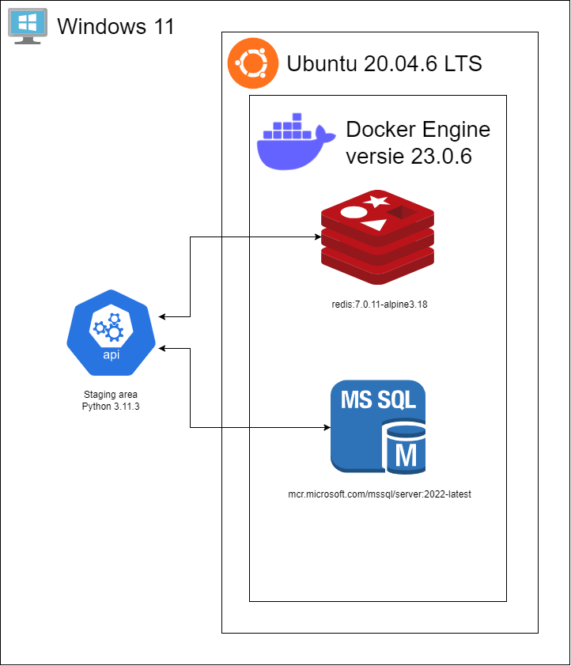

# Technisch ontwerp

- [1 Inleiding](#1-inleiding)
- [2 Systeemarchitectuur](#2-systeemarchitectuur)
  - [2.1 Toelichting systeemarchitectuur](#21-toelichting-systeemarchitectuur)
  - [2.2 Toelichting versies](#22-toelichting-versies)
- [3 Technische gegevensstructuur](#3-technische-gegevensstructuur)
  - [3.1 Fysiek datamodel](#31-fysiek-datamodel)
  - [3.2 Integrity rules](#32-integrity-rules)
  - [3.3 Implementatiekeuzes](#33-implementatiekeuzes)
    - [3.3.1 Docker startup](#331-docker-startup)
    - [3.3.2 tSQLt in Docker](#332-tsqlt-in-docker)
    - [3.3.3 Test coverage en resultaten](#333-test-coverage-en-resultaten)
    - [3.3.4 Triggers en check constraints](#334-triggers-en-check-constraints)
- [4 Technische realisatie](#4-technische-realisatie)
  - [4.1 Stored procedures](#41-stored-procedures)
  - [4.2 Triggers](#42-triggers)
  - [4.3 Check constraints](#43-check-constraints)
  - [4.4 Staging area](#44-staging-area)

## 1. Inleiding

Het doel van het technisch ontwerp is om vast te leggen hoe de technische gegevensstructuur er uit gaat zien. Het moet
mogelijk zijn om hier in terug te vinden welke functionele requirements hebben geleid tot welke ontwerpkeuzes. Door in eerste
instantie de functionele eisen te nummeren is het makkelijker om te verwijzen naar specifieke eisen en kunnen er
bijvoorbeeld business rules opgeschreven worden met het nummer van de originele eis waar deze uit ontstaan zijn. Verder komen
er in dit document een systeemarchitectuur, dit is het conceptueel model dat de structuur, het gedrag en verschillende weergaven van een systeem definieert en
een PDM met de bijhorende integrity rules en een technische realisatie interface.

## 2. Systeemarchitectuur

### 2.1 Toelichting systeemarchitectuur 

In het diagram dat hierboven is weergegeven geeft op hoog niveau de systeemarchitectuur aan. Deze architectuur heeft alleen 
betrekking op materiaal dat het projectteam heeft geleverd. Dit bestaat uit een staging area die geschreven is in 
Python 3.11.3, een instantie van een Redis cache versie 7.0.11-alpine3.18 en een MSSQL server die gebruikt maakt van de 
versie 2022-latest. De Redis cache en MSSQL server worden als containers opgestart door Docker Engine versie 23.0.6. Deze 
Docker Engine loopt in een Windows Subsystem for Linux (WSL) met Ubuntu versie 20.04.6 LTS. 

De staging area communiceert met zowel de Redis cache als de MSSQL server. Het idee achter de architectuur is dat er een 
verzoek wordt gestuurd naar de staging area, die de werkzaamheden hiervan door kan zetten naar de Redis cache of de MSSQL 
server. Als voorbeeld wordt het ophalen van data genomen. Er wordt hierbij een verzoek gestuurd naar de staging area, die 
eerst controleert of de benodigde data gecachet staat in de Redis cache. Wanneer dit zo is, wordt deze data vanuit deze cache 
naar de staging area gestuurd op een manier die de staging area kan verwerken. Wanneer de gewenste data niet in de cache te 
vinden is, zal deze opgehaald worden van de MSSQL server, waarna deze data gecachet wordt en verwerkt wordt door de staging 
area. 

### 2.2 Toelichting versies

Bij het kiezen van de versies van de gebruikte systemen is rekening gehouden met de long term support (LTS) voor deze 
systemen. Hieronder staan de versies van systemen die gebruikt worden:

- Staging area: Python 3.11.3
- Windows: Windows 11
- Redis cache: redis:7.0.11-alpine3.18
- MSSQL server: mcr.microsoft.com/mssql/server:2022-latest
- Docker Engine: Docker Engine version 23.0.6
- WSL: Ubuntu 20.04.6 LTS

De staging area wordt gedraaid op het Windows 11 operating system en is geschreven in Python 3.11.3. Windows 11 is het huidige 
Windows operating system waar ondersteuning voor gegeven wordt. Python 3.11.3 is de meest recente versie van Python 3 waarvoor 
long term support gegeven wordt. 

Zowel de Redis cache als de MSSQL server worden gedraaid op een Docker Container, die gedraaid wordt in de Docker Engine. 
Deze Docker Engine draait op een WSL met Ubuntu versie 20.04.6 LTS. Voor deze versie is gekozen, 
zodat gebruik gemaakt kan worden van de meest recente versie van de MSSQL server die long term support aanbiedt. Deze 
versie is MSSQL 2022-latest. De Docker Engine maakt gebruik van versie 23.0.6. Ook dit is de meest recente versie die long 
term support biedt. 

Tot slot wordt gebruik gemaakt van een Redis cache. Deze gebruikt versie 7.0.11-alpine3.18. Deze versie is te ontleden in de 
onderdelen 7.0.11, alpine en 3.18. 7.0.11 Is de meest recente versie van Redis die long term support aanbiedt. Alpine is de variant 
van Redis die simpel en veilig is om te gebruiken. Hoewel dit een compactere variant is die ontworpen is voor projecten met een 
kleinere scope, is de alpine variant voldoende voor de doeleinden van dit project. Tot slot is 3.18 de meest recente versie 
van Alpine Linux die long term support aanbiedt.

## 3. Technische gegevensstructuur

### 3.1 Fysiek datamodel

### 3.2 Integrity rules

Per integrity rule word naar een trigger verwezen die deze integrity rule afvangt. De triggers die geïmplementeerd 
zijn zijn te vinden in de tabel in hoofdstuk 5.2 Triggers.

| **Code** | **Integrity rule**                                                                                                                                                                                                                       | Gerelateerde constraint(s) | Trigger of Check-constraint |
|----------|------------------------------------------------------------------------------------------------------------------------------------------------------------------------------------------------------------------------------------------|----------------------------|-----------------------------|
| IR-01    | Triggers op de tabellen RoomReservation, MachineReservation en MemberGroupClass die voorkomen dat reserveringen of inschrijvingen overlappen met andere reserveringen of inschrijvingen die gemaakt zijn door dezelfde Member.           | CR-01                      | TRG-02, TRG-05, TRG-06      |
| IR-02    | Triggers op de GroupClass en FitnessRoomSchedule tabellen die vereisen dat de opgegeven Employee geen diensten heeft of groepslessen geeft die overlappen met de opgegeven tijden.                                                       | CR-02                      | TRG-01, TRG-04              |
| IR-03    | Check-constraint op Member tabel die vereist dat als de birthdate van een member < 18 is dat er dan guardian informatie vereist is.                                                                                                      | SDR-03                     | CK-07                       |
| IR-04    | Check-constraint op de tabel RoomReservation: quantity > 0.                                                                                                                                                                              | CR-04                      | CK-10                       |
| IR-05    | Trigger op de MachineReservation tabel die vereist dat de machine_status van Machine niet gelijk is aan 'out of order'.                                                                                                                  | CR-05                      | TRG-06                      |
| IR-06    | Trigger op de GroupClass tabel die vereist dat de opgegeven Employee de opgegeven GroupClassType zelf ook kent.                                                                                                                          | CR-06                      | TRG-01                      |
| IR-07    | Trigger op de Subscription tabel die vereist dat de start_date van Subscription plus de min_length van de bijbehorende SubscriptionType kleiner is dan de huidige datum.                                                                 | CR-07                      | TRG-03                      |
| IR-08    | Trigger op de RoomReservation tabel die vereist dat de Room met het opgegeven room_id als functionality 'Squash' heeft.                                                                                                                  | SDR-08                     | TRG-05                      |
| IR-09    | Trigger op de FitnessRoomSchedule tabel die vereist dat de Room met het opgegeven room_id als functionality 'Fitness room' heeft.                                                                                                        | SDR-09                     | TRG-04                      |
| IR-10    | Trigger op de GroupClass tabel die vereist dat de Room met het opgegeven room_id als functionality 'GroupClass' heeft.                                                                                                                   | SDR-10                     | TRG-01                      |
| IR-11    | Check-constraint op de tabel SubscriptionType: min_length > 0.                                                                                                                                                                           | CR-11                      | CK-15                       |
| IR-12    | Triggers op de tabellen RoomReservation, MachineReservation en MemberGroupClass die checken of de start_timestamp van de RoomReservation, MachineReservation of MemberGroupClass na de end_date van een Subscription van de Member ligt. | CR-12                      | TRG-02, TRG-06, TRG-06      |
| IR-13    | Trigger op de Subscription tabel die vereist dat de leeftijd binnen het toegestane bereik valt voor het opgegeven abonnementstype.                                                                                                       | C-13                       | TRG-03                      |
| IR-14    | Trigger op de Subscription tabel die vereist dat een lid niet nog een actief abonnement heeft van hetzelfde abonnementstype.                                                                                                             | C-14                       | TRG-03                      |

### 3.3 Implementatiekeuzes

#### 3.3.1 Docker startup
Er is aan het begin van het project besloten om Docker te gebruiken om het systeem aan de opdrachtgever op te leveren.
MSSQL in Docker heeft geen automatische manier om bij het opstarten scripts uit te voeren, wat voor enige moeilijkheden
zorgde, elke keer als de Docker opnieuw opgestart moest worden, moesten alle scripts handmatig uitgevoerd worden.

Er is gekozen om er tijd in te steken om dit zelf te automatiseren. Door middel van een bash-script worden een hoofddatabase
en een testdatabase aangemaakt, waar bij het opstarten alle huidige stored procedures en triggers automatisch worden
getest en de resultaten in een terminal worden weergegeven. Dit geeft bij het opstarten een actueel overzicht van de
status van de database en waar aandacht aan besteed moet worden.

#### 3.3.2 tSQLt in Docker
Bij dit project wordt gebruik gemaakt van Docker. Dit geldt voor zowel de normale SQL-code als de tests die voor deze code 
geschreven zijn. Het gebruik van tSQLt als test framework bracht complicaties met het gebruik van Docker met zich mee. De gezipte 
map van tSQLt die afkomstig is van het internet is, voldoet niet aan de huidige internationale .zip voorwaarden voldoet en 
gebruik maakt van backslashes. In Docker werkt het omzetten van backslashes naar forward slashes tijdens het builden 
van een image niet, wat ervoor heeft gezorgd dat Docker de gezipte map als corrupt zag.

Dit probleem is met de opdrachtgever besproken met als conclusie dat het voor de scope van dit project voldoende is om het 
tSQLt framework direct in de projectstructuur op te nemen. Dit heeft als gevolg dat er nu een vaste versie van tSQLt gebruikt 
wordt. Deze versie is 1.0.8083.3529. Deze versie is op het moment van downloaden de meest recente versie.

#### 3.3.3 Test coverage en resultaten
Wij hebben ervoor gekozen om een test coverage te laten genereren, dit hebben wij besloten na een gesprek met de opdrachtgever waarin hij ons 
vroeg: Wat dekken deze tests eigenlijk af? Wat testen ze? Hoe weten we dat alle scenario's getest worden? Hierna hebben wij onderzoek gedaan
naar test coverage, dit is een automatisch gegenereerd HTML-bestand waarin alle tests benoemd worden en de procentuele waarden van de coverage.
Dit betekent dat als er een procedure of trigger getest wordt, dan laadt de coverage met deze procentuele waarde zien hoeveel procent van de procedure of trigger er getest wordt.
Ook worden er testresultaten uit de database gehaald en in een CSV-bestand gezet zodat in een blik gezien kan worden wat de resultaten van de tests zijn.

#### 3.3.4 Triggers en check constraints
Tijdens het maken van triggers hebben we besloten om check constraint te gebruiken bij checks van alleen op de ingevoerde data van 1 tabel. Dit hebben we
besloten, omdat simpele checks meer moeite kosten om te maken in een trigger dan in een check constraint. Triggers willen we dus inzetten bij checks, die
de ingevoerde data checkt met data van andere tabellen. Dit hebben we besloten, omdat dit makkelijker is om te doen in een trigger dan in een check constraint.

## 4. Technische realisatie

### 4.1 Stored procedures

Alle stored procedures zijn te vinden in de volgende mappenstructuur:
` best-fit-gym/docker/scripts/procedures/ `

| **Code** | **Stored procedure**             | **Beschrijving**                                                       |
|----------|----------------------------------|------------------------------------------------------------------------|
| SPROC-01 | sproc_addMember                  | Maakt een nieuwe lid aan.                                              |
| SPROC-02 | sproc_subscribeMember            | Activeert een abonnement voor een bestaande lid.                       |
| SPROC-03 | sproc_prolongSubscription        | Verlengt een abonnement met een aantal maanden.                        |
| SPROC-04 | sproc_getSubscriptionInformation | Haalt informatie op over de abonnement van een lid.                    |
| SPROC-05 | sproc_cancelSubscription         | Annuleert het geselecteerde abonnement.                                |
| SPROC-06 | sproc_scheduleGroupClass         | Roostert een nieuwe groepsles in.                                      |
| SPROC-07 | sproc_viewGroupClass             | Haalt de groepslessen op van een lid voor de komende maand.            |
| SPROC-08 | sproc_signInGroupClass           | Schrijft een lid in voor een groepsles.                                |
| SPROC-09 | sproc_getEmployeeSchedules       | Haalt de roosters op van een medewerker voor de komende maand.         |
| SPROC-10 | sproc_cancelGroupClass           | Annuleert een ingeplande groepsles.                                    |
| SPROC-11 | sproc_signOutGroupClass          | Een lid wordt uitgeschreven voor een groepsles.                        |
| SPROC-12 | sproc_assignEmployee             | Wijst een medewerker toe aan een fitness ruimte met een datum en tijd. |
| SPROC-13 | sproc_viewMemberReservations     | Haalt informatie over gemaakte reserveringen van een lid op.           |
| SPROC-14 | sproc_editGroupClass             | Wijzigt de gegevens van een ingeplande groepsles.                      |
| SPROC-15 | sproc_cancelReservation          | Annuleert een reservering van een lid voor een machine of ruimte.      |
| SPROC-16 | sproc_bookSquashRoom             | Boekt een reservering op een squash ruimte voor een lid.               |
| SPROC-17 | sproc_bookMachine                | Boekt een reservering voor een machine voor een lid                    |
| SPROC-18 | sproc_switchMachineStatus        | De machine status wordt geswitched tussen 'Out of order' en 'Active'.  |
| SPROC-19 | sproc_editMachineReservation     | Een reservering voor een machine wordt aangepast.                      |
| SPROC-20 | sproc_editSquashRoomReservation  | Een reservering voor een squash ruimte wordt aangepast.                |

| **Use case** | **Stored procedure** |
|--------------|----------------------|
| UC-01        | SPROC-02             |
| UC-02        | SPROC-03             |
| UC-03        | SPROC-05             |
| UC-04        | SPROC-04             |
| UC-05        | SPROC-08             |
| UC-06        | SPROC-11             |
| UC-07        | SPROC-16, SPROC-17   |
| UC-08        | SPROC-15             |
| UC-09        | SPROC-19, SPROC-20   |
| UC-10        | SPROC-09             |
| UC-11        | SPROC-18             |
| UC-12        | SPROC-06             |
| UC-13        | SPROC-14             |
| UC-14        | SPROC-10             |
| UC-15        | SPROC-12             |
| UC-16        | SPROC-01             |

### 4.2 Triggers

Alle triggers zijn te vinden in de volgende mappenstructuur:
` best-fit-gym/docker/scripts/triggers/ `

| **Code** | **Trigger**                          | **Beschrijving**                                                                                                                                                                                                                                                    |
|----------|--------------------------------------|---------------------------------------------------------------------------------------------------------------------------------------------------------------------------------------------------------------------------------------------------------------------|
| TRG-01   | trg_GroupClass_insertUpdate          | Deze trigger test of de toe te voegen groepsles voldoet aan de volgende checks: de ruimte is geschikt voor groepslessen, de aangegeven werknemer heeft de competentie om deze specifieke les te geven en dat deze werknemer op dat bepaalde tijdstip beschikbaar is |
| TRG-02   | trg_MemberGroupClass_insertUpdate    | Deze trigger test of het lid dat zich inschrijft voor een groepsles een actief abonnement heeft en of het lid niet al ingeschreven staat voor een groepsles of een andere reservering op hetzelfde tijdstip.                                                        |
| TRG-03   | trg_Subscription_insertUpdate        | Deze trigger test of de toe te voegen abonnement voldoet aan de volgende checks: de leeftijd van de gebruiker valt binnen het toegestane bereik voor het abonnementstype en de gebruiker heeft geen actief abonnement van hetzelfde abonnementstype.                |
| TRG-04   | trg_FitnessRoomSchedule_insertUpdate | Deze trigger test of het toewijzen van een medewerker voldoet aan de volgende checks: de ruimte is een fitness ruimte en de medewerker is beschikbaar op het tijdstip van de toewijzing.                                                                            |
| TRG-05   | trg_RoomReservation_insertUpdate     | Deze trigger test of het boeken van een squash ruimte reservering voldoet aan de volgende checks: de ruimte is een squash ruimte, het lid is beschikbaar op het moment van de reservering en de ruimte is niet in gebruik voor andere activiteiten.                 |
| TRG-06   | trg_MachineReservation_insertUpdate  | Deze trigger test of het lid op het moment van de reservering nog een abonnement heeft, de machine niet buiten gebruik is, of de machine vrij is en of het lid niet al een andere reservering heeft om die tijd.                                                    |

### 4.3 Check-constraints

| **Code** | **Check-constraint**                | **Beschrijving**                                                                                                                                                                                                                |
|----------|-------------------------------------|---------------------------------------------------------------------------------------------------------------------------------------------------------------------------------------------------------------------------------|
| CK-01    | ck_fitnessroomschedule_start_end    | Deze check-constraint handhaaft dat de start_timestamp voor de end_timestamp moet zijn op de tabel FitnessRoomSchedule.                                                                                                         |
| CK-02    | ck_groupclass_start_end             | Deze check-constraint handhaaft dat de start_timestamp voor de end_timestamp moet zijn op de tabel GroupClass.                                                                                                                  |
| CK-03    | ck_groupclasstype_max_participants  | Deze check-constraint handhaaft dat de max_participants van een bepaalde Groepsles-type meer dan 0 moet zijn op de tabel GroupClassType.                                                                                        |
| CK-04    | ck_machinereservation_start_end     | Deze check-constraint handhaaft dat de start_timestamp voor de end_timestamp moet zijn op de tabel MachineReservation.                                                                                                          |
| CK-05    | ck_member_birthdate                 | Deze check-constraint handhaaft dat de birthdate van een lid voor de huidige datum moet liggen op de tabel Member.                                                                                                              |
| CK-06    | ck_member_guardian_birthdate        | Deze check-constraint handhaaft dat de guardian_birthdate voor de birthdate van de betreffende member is, dat de guardian_birthdate voor de huidige datum is en dat de guardian minimaal 18 jaar of ouder is op de tabel Member. |
| CK-07    | ck_member_minor_guardian_filled     | Deze check-constraint handhaaft dat er guardian informatie is ingevuld wanneer een lid jonger is dan 18 jaar op de tabel Member.                                                                                                |
| CK-08    | ck_room_max_people                  | Deze check-constraint handhaaft dat de max_participants van een bepaalde Groepsles-type meer dan 0 moet zijn op de tabel Room.                                                                                                  |
| CK-09    | ck_roomreservation_start_end        | Deze check-constraint handhaaft dat de start_timestamp voor de end_timestamp moet zijn op de tabel RoomReservation.                                                                                                             |
| CK-10    | ckc_quantity_roomrese               | Deze check-constraint handhaaft dat de quantity van een RoomReservation meer moet zijn dan 0 op de tabel RoomReservation.                                                                                                       |
| CK-11    | ck_subscription_start_date_end_date | Deze check-constraint handhaaft dat de start_timestamp voor de end_timestamp moet zijn op de tabel Subscription.                                                                                                                |
| CK-12    | ck_subscriptiontype_max_age         | Deze check-constraint handhaaft dat de maximale leeftijd van een abonnementstype hoger moet zijn dan 0 op de tabel SubscriptionType.                                                                                            |
| CK-13    | ck_subscriptiontype_min_age         | Deze check-constraint handhaaft dat de minimale leeftijd van een abonnementstype hoger moet zijn dan 0 op de tabel SubscriptionType.                                                                                            |
| CK-14    | ck_subscriptiontype_min_age_max_age | Deze check-constraint handhaaft dat de minimale leeftijd onder de maximale leeftijd is op de tabel SubscriptionType.                                                                                                            |
| CK-15    | ck_subscriptiontype_min_length      | Deze check-constraint handhaaft dat de minimale lengte van een abonnementstype meer is dan 0 op de tabel SubscriptionType.                                                                                                      |
| CK-16    | ck_subscriptiontype_notice_period   | Deze check-constraint handhaaft dat de notice_period hoger is dan 0 op de tabel SubscriptionType.                                                                                                                               |

### 4.4 Staging area
In de code die verantwoordelijk is voor het genereren van testdata wordt er data gegenereerd waarbij de medewerkers en leden die gegenereerd worden
geen overlappende activiteiten hebben. Er wordt daarentegen geen rekening gehouden met de beschikbaarheid van ruimtes en machines. De code die nodig was om
beide deze problemen aan te pakken was iets te complex om te schrijven met de beperkte tijd die we hadden. Daarom hebben we ervoor gekozen om hier geen rekening mee te houden.
Het gevolg hiervan is dat bij te genereren van testdata soms een foutmelding kan optreden. Er zijn twee manieren om dit te voorkomen. De eerste manier om het
te voorkomen is om minder data te genereren. Wanneer er minder data gegenereerd wordt is de kans kleiner dat deze foutmelding voor kan komen omdat er dan minder willekeurige
tijden gegenereerd worden. De tweede manier om dit te voorkomen is om de beperkingen die de foutmeldingen veroorzaken tijdelijk uit te zetten. In het tweede geval gaat
het om de insert en update triggers op de RoomReservation en MachineReservation tabellen.

De staging area is te vinden in de volgende mappenstructuur:
` best-fit-gym/staging_area/bestfit `
Alle code die gebruikt wordt in de staging area is te vinden in het bestand ` best-fit-gym/staging_area/bestfit/src/bestfit/bestfit.py`
De volgende klassen en functies zijn hier te vinden:

| **Klasse**       | **Functie**             | **Beschrijving**                                                                        |
|------------------|-------------------------|-----------------------------------------------------------------------------------------|
| BestFitCacher    | cache_schedule          | Haalt de roosters van alle medewerkers op uit de database en slaat deze op in een cache |
| BestFitCacher    | cache_reservations      | Haalt de reserveringen van alle leden op uit de database en slaat deze op in een cache  |
| BestFitCacher    | get_from_db             | Haalt informatie op uit de database op basis van een meegegeven stored procedure        |
| BestFitCacher    | put_in_cache            | Slaat informatie op in de cache op basis van een meegegeven key                         |
| BestFitRoster    | get_employee_schedule   | Haalt het rooster van een medewerker op uit de cache op basis van een meegegeven ID     |
| BestFitRoster    | get_member_reservations | Haalt de reserveringen van een lid op uit de cache op basis van een meegegeven ID       |
| BestFitRoster    | get_from_cache          | Haalt informatie op uit de cache op basis van een meegegeven key                        |
| BestFitGenerator | generate_test_data      | Genereert test data voor de database                                                    |